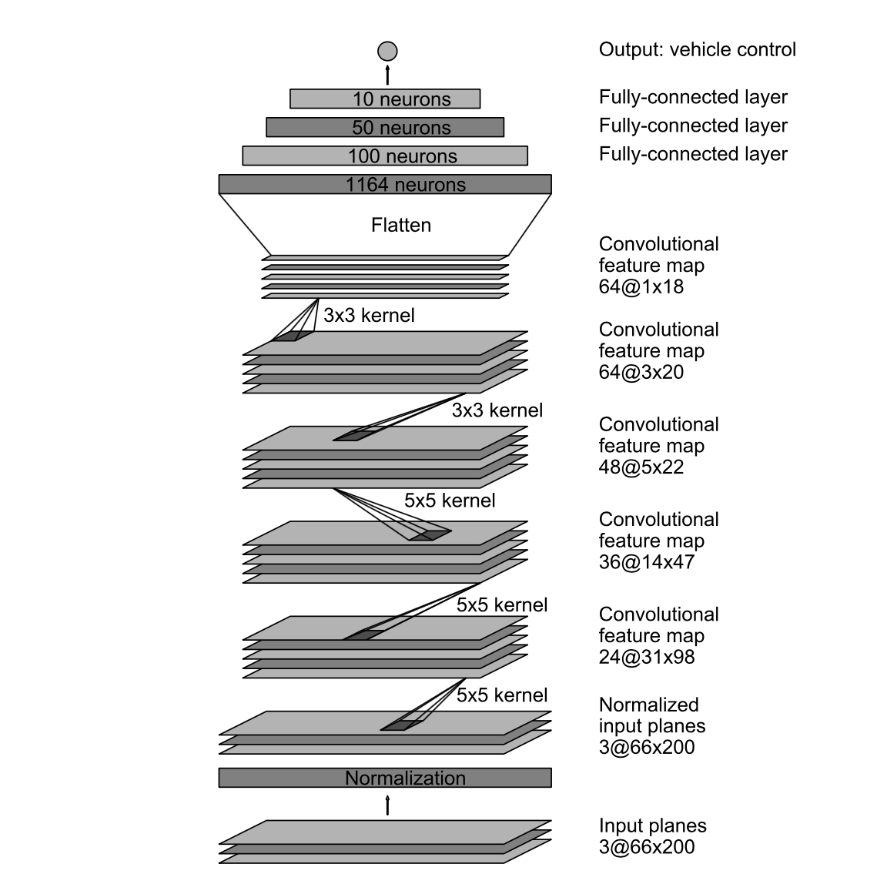
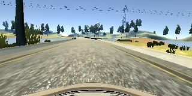
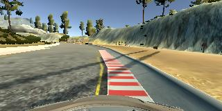
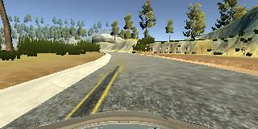
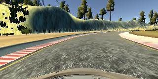
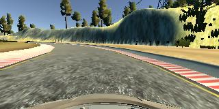

# **Behavioral Cloning**

---

**Behavioral Cloning Project**

The goals / steps of this project are the following:
* Use the simulator to collect data of good driving behavior
* Build, a convolution neural network in Keras that predicts steering angles from images
* Train and validate the model with a training and validation set
* Test that the model successfully drives around track one without leaving the road
* Summarize the results with a written report


[//]: # (Image References)

[image1]: ./pic/model-visualization.png "Model Visualization"
[summary]: ./pic/nvsum.png "Sum"
[image2]: ./pic/center.jpg "Grayscaling"
[image3]: ./pic/r1.jpg "Recovery Image"
[image4]: ./pic/r2.jpg "Recovery Image"
[image5]: ./pic/r3.jpg "Recovery Image"
[image6]: ./pic/flip.jpg "Normal Image"
[image7]: ./pic/ff.jpg "Flipped Image"

## Rubric Points
#### Here I will consider the [rubric points](https://review.udacity.com/#!/rubrics/432/view) individually and describe how I addressed each point in my implementation.  

---
### Files Submitted & Code Quality

#### 1. Submission includes all required files and can be used to run the simulator in autonomous mode

My submit contains the following files:
* model.py containing the script to create and train the model
* drive.py for driving the car in autonomous mode
* model.h5 containing a trained convolution neural network
* writeup_report.md or writeup_report.pdf summarizing the results

#### 2. Submission includes functional code
Using the Udacity provided simulator, drive.py file and my model.h5 , the car can be driven autonomously around the track by executing
```sh
python drive.py model.h5
```

#### 3. Submission code is usable and readable

The model.py file contains the code for training and saving the convolution neural network. The file shows the pipeline I used for training and validating the model, and it contains comments to explain how the code works.

### Model Architecture and Training Strategy

#### 1. An appropriate model architecture has been employed

My model consists of a convolution neural network with  5x5 & 3x3 filter sizes and depths between 24 and 64 (model.py lines 93-126), which is shown below:

________________________________________________________________
Layer (type)                 Output Shape              Param #   
________________________________________________________________
lambda_1 (Lambda)            (None, 160, 320, 3)       0         
_________________________________________________________________
cropping2d_1 (Cropping2D)    (None, 90, 320, 3)        0         
_________________________________________________________________
conv2d_1 (Conv2D)            (None, 43, 158, 24)       1824      
_________________________________________________________________
activation_1 (Activation)    (None, 43, 158, 24)       0         
_________________________________________________________________
dropout_1 (Dropout)          (None, 43, 158, 24)       0         
_________________________________________________________________
conv2d_2 (Conv2D)            (None, 20, 77, 36)        21636     
_________________________________________________________________
activation_2 (Activation)    (None, 20, 77, 36)        0         
_________________________________________________________________
dropout_2 (Dropout)          (None, 20, 77, 36)        0         
_________________________________________________________________
conv2d_3 (Conv2D)            (None, 8, 37, 48)         43248     
_________________________________________________________________
activation_3 (Activation)    (None, 8, 37, 48)         0         
_________________________________________________________________
dropout_3 (Dropout)          (None, 8, 37, 48)         0         
_________________________________________________________________
conv2d_4 (Conv2D)            (None, 6, 35, 56)         24248     
_________________________________________________________________
activation_4 (Activation)    (None, 6, 35, 56)         0         
_________________________________________________________________
dropout_4 (Dropout)          (None, 6, 35, 56)         0         
_________________________________________________________________
conv2d_5 (Conv2D)            (None, 4, 33, 64)         32320     
_________________________________________________________________
activation_5 (Activation)    (None, 4, 33, 64)         0         
_________________________________________________________________
flatten_1 (Flatten)          (None, 8448)              0         
_________________________________________________________________
dense_1 (Dense)              (None, 100)               844900    
_________________________________________________________________
activation_6 (Activation)    (None, 100)               0         
_________________________________________________________________
dense_2 (Dense)              (None, 50)                5050      
_________________________________________________________________
activation_7 (Activation)    (None, 50)                0         
_________________________________________________________________
dense_3 (Dense)              (None, 1)                 51        

Total params: 973,277
Trainable params: 973,277
Non-trainable params: 0

The model includes RELU layers to introduce nonlinearity (code line 99,103,107,111,120,122), and the data is normalized in the model using a Keras lambda layer (code line 94) at the first of the model.

#### 2. Attempts to reduce overfitting in the model

The model contains dropout layers in order to reduce overfitting (model.py lines 100,104,108,112).

The model was trained and validated on different data sets to detect that if the model was overfitting (code line 33-37). The model was tested by running it through the simulator to check if the vehicle would fall off the road.

#### 3. Model parameter tuning

The model used an adam optimizer, so the learning rate was not tuned manually (model.py line 128).

#### 4. Appropriate training data

Training data was chosen to keep the vehicle driving on the road. I used a combination of center lane driving, recovering from the left & right sides of the road,  

 * 3 laps of center lane driving(clock wise and counter-clock wise)
 * 2 lap of recovery driving from the sides
 * 2 lap focusing on driving smoothly around curves
 * some examples of passing the lake region and dust region 

For details about how I created the training data, see the next section.

### Model Architecture and Training Strategy

#### 1. Solution Design Approach

My first step was to build a 1 layer linear model to build up the environment.

The second step was to use a Lenet5 model.
But it seems not working well.
Some guys on Slack suggest to use NVIDIA model which seems to be more suitable.
So I change my model to NVIDIA model which you have seen above. 

Firstly, I collect only two laps of center lane driving (counter-clock wise).
After I have trained my model, and run it on the smulator.
It seems going well on straight lanes but going bad on curve lane.
Then I collect some more data such as 
1.center lane driving of clockwise
2.some recovery driving situation which only record driving from the side to center
3.two laps that only record the curve lane
 
After collecting these data and train the model, in simulator it goes much better.
but it still fall off the road at 3 situation.
1.it fall into the lake before the bridge.
2.it fall off the road after passing the second curve behind the bridge.
3.it run into the dust region and can not make it itself.

So I collect more data to focusing on these 3 situation.
Also I collect one lap of Track2 to make the steering angle more suitable for the road.

After I train the model, it goes well and could go around the whole lap without fall off the road. 


#### 2. Final Model Architecture

The final model architecture (model.py lines 93-126) was build based on the NVIDIA paper which is shown above and it has been proven to be a effective model.


#### 3. Creation of the Training Set & Training Process

To capture good driving behavior, I first recorded 3 laps both clockwise and counter-clockwise on track one using center lane driving. Here is an example image of center lane driving:



I then recorded the vehicle recovering from the left side and right sides of the road back to center so that the vehicle would learn to keep straight, go through the bridge, turn the curve smoothly, and go back to the road center. These images show what a recovery looks like starting from ... :





To augment the data sat, I also flipped images and angles thinking that this would reduce the impact of fixed direction. For example, here is an image that has then been flipped:





 I then preprocessed this data by normalized, reduce mean and cropping.


I finally randomly shuffled the data set and put 20% of the data into a validation set.

I used this training data for training the model. The validation set helped determine if the model was over or under fitting. The ideal number of epochs was 5 as evidenced by large mount of experiments. I used an adam optimizer so that manually training the learning rate wasn't necessary.

## Others
I use AWS GPU following Udacity AWS tutorial, which I can not use the free 50 dollar credit, so I use my credit card to train the model on AWS.
It confused me very much, because I never use AWS before， so everything is new and I met several issue and it take me couple of weeks to solve that, which make me exhausted and nearly make me lose my patience.
After I run through the circumstance, it seems like to bring light to me.

## What's more

When I use my model.h5 to run the simulator on autonomous mode. It sometime good and some times is not so good.
I will collect more data to train my model to make it always good.


